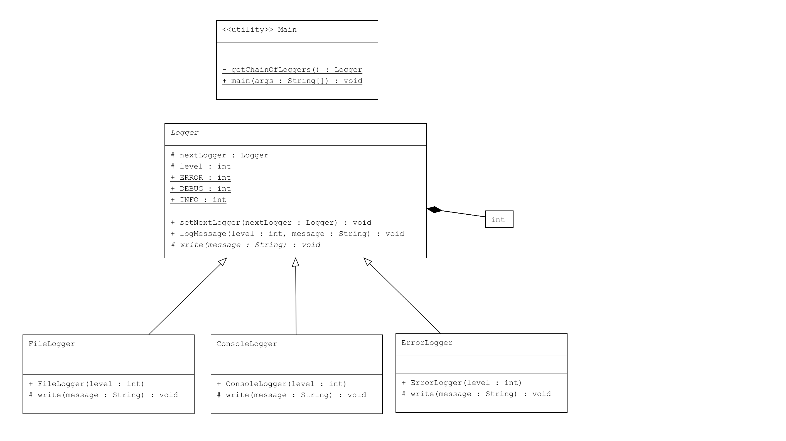

# Chain of Responsibility Pattern : Log İşleme Sistemi

Bu proje, Java'da Chain of Responsibility Pattern kullanarak bir hata (log) işleme sistemi geliştirmektedir. Bu desen, isteklerin (log mesajlarının) bir zincir boyunca ele alındığı ve her bir nesnenin isteği işleyip işlemeyeceğine karar verdiği bir tasarım desenidir.

## Örnek Senaryo

Bu örnekte:

- **Logger Sınıfı (`Logger.java`)**: Soyut sınıf olup log mesajlarını işlemek için bir arayüz sağlar ve bir sonraki log işleyicisini tanımlar.
- **ConsoleLogger Sınıfı (`ConsoleLogger.java`)**: Log mesajlarını konsola yazan bir alt sınıftır.
- **ErrorLogger Sınıfı (`ErrorLogger.java`)**: Hata loglarını konsola yazan bir alt sınıftır.
- **FileLogger Sınıfı (`FileLogger.java`)**: Log mesajlarını dosyaya yazan bir alt sınıftır.
- **Kullanım (Client - `Main.java`)**: Zinciri oluşturur ve log mesajlarını işler.

## Kod Yapısı

---
## Kod Yapısı

Tüm sınıflar `src/` dizini altında bulunmaktadır.

### 1. `Logger` Sınıfı

Dosya: `src/Logger.java`

Soyut sınıftır ve bir zincirin parçası olarak log mesajlarını işlemek için gerekli yapıyı tanımlar.

### 2. `ConsoleLogger` Sınıfı

Dosya: `src/ConsoleLogger.java`

`Logger` sınıfından türetilmiştir ve log mesajlarını konsola yazdırır.

### 3. `ErrorLogger` Sınıfı

Dosya: `src/ErrorLogger.java`

`Logger` sınıfından türetilmiştir ve hata mesajlarını konsola yazdırır.

### 4. `FileLogger` Sınıfı

Dosya: `src/FileLogger.java`

`Logger` sınıfından türetilmiştir ve log mesajlarını dosyaya yazdırır.

### 5. Kullanım (Client)

Dosya: `src/Main.java`

`Main` sınıfı, log zincirini oluşturur ve farklı seviyelerde log mesajlarını işler.

## Açıklama

`Chain of Responsibility Pattern`, bir isteğin bir zincir boyunca ele alındığı ve her bir nesnenin isteği işleyip işlemeyeceğine karar verdiği bir yapısal tasarım desenidir. Bu desen, isteklerin işlenmesini dinamik olarak zincirdeki bir sonraki nesneye devretmek için kullanılır.

Bu örnekte, log mesajları `INFO`, `DEBUG` ve `ERROR` seviyelerine göre işlenir ve her seviye kendi log handler'ı tarafından ele alınır. Her log handler, bir sonraki log handler'ı belirterek zincir oluşturur ve log mesajlarını işler.

## Lisans

Bu proje [MIT Lisansı](LICENSE) altında lisanslanmıştır.
