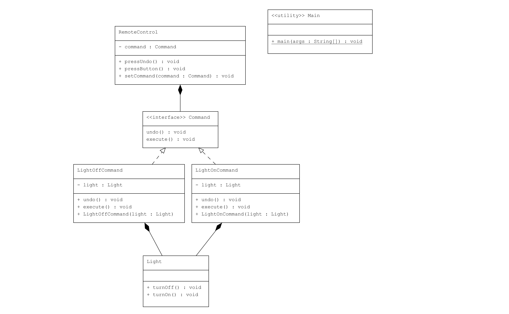

# Command Pattern : Ev Otomasyonu Sistemi

Bu proje, Java'da Command Pattern kullanarak basit bir ev otomasyonu sistemi geliştirmektedir. `Command Pattern`, işlemleri nesne olarak kapsüllemenizi ve istemcilerin işlemleri, parametrelerini ve geri alma (undo) işlemlerini bağımsız olarak yönetmesini sağlar.

## Örnek Senaryo

Bu örnekte:

- **Command Arayüzü (`Command.java`)**: Komutları temsil eden arayüzdür ve `execute()` ve `undo()` metodlarını tanımlar.
- **Light Sınıfı (`Light.java`)**: Receiver sınıfıdır ve ışığın açılıp kapatılması işlemlerini gerçekleştirir.
- **LightOnCommand Sınıfı (`LightOnCommand.java`)**: Işığı açma komutunu temsil eder ve `Command` arayüzünü uygular.
- **LightOffCommand Sınıfı (`LightOffCommand.java`)**: Işığı kapatma komutunu temsil eder ve `Command` arayüzünü uygular.
- **RemoteControl Sınıfı (`RemoteControl.java`)**: Invoker sınıfıdır ve komutları yürütmek için kullanılır.
- **Kullanım (Client - `Main.java`)**: Komutların nasıl oluşturulup yürütüldüğünü gösterir.

## Kod Yapısı

---

## Kod Yapısı

Tüm sınıflar `src/` dizini altında bulunmaktadır.

### 1. `Command` Arayüzü

Dosya: `src/Command.java`

Komut arayüzü olup, `execute()` ve `undo()` metodlarını tanımlar.

### 2. `Light` Sınıfı

Dosya: `src/Light.java`

Receiver sınıfıdır ve ışığın açılıp kapatılması işlemlerini gerçekleştirir.

### 3. `LightOnCommand` Sınıfı

Dosya: `src/LightOnCommand.java`

`Command` arayüzünü uygulayan ve ışığı açma işlemini gerçekleştiren bir sınıftır.

### 4. `LightOffCommand` Sınıfı

Dosya: `src/LightOffCommand.java`

`Command` arayüzünü uygulayan ve ışığı kapatma işlemini gerçekleştiren bir sınıftır.

### 5. `RemoteControl` Sınıfı

Dosya: `src/RemoteControl.java`

Invoker sınıfıdır ve komutları yürütmek için kullanılır.

### 6. Kullanım (Client)

Dosya: `src/Main.java`

`Main` sınıfı, komutların nasıl oluşturulup yürütüldüğünü gösterir.

## Örnek Çıktı

Kodun çalıştırılması sonucunda alınacak örnek çıktı:
```
Light is ON  
Light is OFF  
Light is OFF  
Light is ON
```

## Açıklama

`Command Pattern`, bir işlemi nesne olarak kapsüller ve işlemleri, parametrelerini ve geri alma (undo) işlemlerini bağımsız olarak yönetmeye olanak tanır. Bu desen, istemcinin işlem mantığını bilmeden komutları parametreleştirmesine ve geri almasına izin verir.

Bu örnekte, `RemoteControl` sınıfı (Invoker), komutları yönetmek için kullanılır ve istemci kodunun bu komutları nasıl oluşturduğunu ve yürüttüğünü gösterir. Işığın açılıp kapatılması işlemleri, ilgili komut sınıfları (`LightOnCommand` ve `LightOffCommand`) aracılığıyla yapılır ve her komut kendi geri alma (undo) işlemini destekler.

## Lisans

Bu proje [MIT Lisansı](LICENSE) altında lisanslanmıştır.
