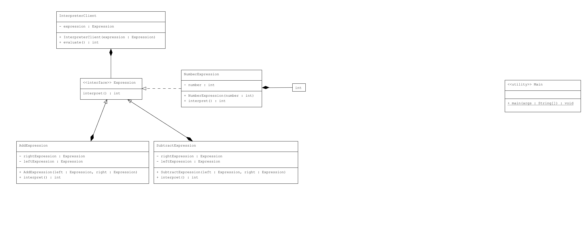

# Interpreter Pattern : Matematiksel İfadeler

Bu proje, Java'da Interpreter Pattern kullanarak matematiksel ifadeleri yorumlama işlemini göstermektedir.

## Örnek Senaryo

Bu örnekte:
- **Expression**: İfadelerin yorumlanmasını tanımlayan bir arayüzdür.
- **NumberExpression**: Sabit sayıları temsil eden sınıftır.
- **AddExpression** ve **SubtractExpression**: Toplama ve çıkarma işlemlerini gerçekleştiren sınıflardır.
- **InterpreterClient**: Bir `Expression` nesnesini yorumlayan sınıftır.
- **Main**: Farklı matematiksel ifadeleri oluşturur ve sonuçları gösterir.

## Uml Diagram


---
## Kod Yapısı

Tüm sınıflar `src/` dizini altında bulunmaktadır.

### 1. `Expression` Arayüzü

Dosya: `src/Expression.java`

`Expression` arayüzü, ifadelerin yorumlanması için `interpret()` metodunu tanımlar.

### 2. `NumberExpression` Sınıfı

Dosya: `src/NumberExpression.java`

`NumberExpression` sınıfı, sabit sayıları temsil eder ve `interpret()` metodunu kullanarak bu sayıyı döndürür.

### 3. `AddExpression` Sınıfı

Dosya: `src/AddExpression.java`

`AddExpression` sınıfı, iki ifadenin toplamını hesaplar. `interpret()` metodunu, sol ve sağ ifadelerin sonuçlarını toplamak için kullanır.

### 4. `SubtractExpression` Sınıfı

Dosya: `src/SubtractExpression.java`

`SubtractExpression` sınıfı, iki ifadenin farkını hesaplar. `interpret()` metodunu, sol ifadenin sonucundan sağ ifadenin sonucunu çıkarmak için kullanır.

### 5. `InterpreterClient` Sınıfı

Dosya: `src/InterpreterClient.java`

`InterpreterClient` sınıfı, bir `Expression` nesnesini alır ve bu ifadeyi yorumlar. `evaluate()` metodu, `interpret()` metodunu çağırarak sonucu döndürür.

### 6. `Main` Sınıfı

Dosya: `src/Main.java`

`Main` sınıfı, `NumberExpression`, `AddExpression` ve `SubtractExpression` sınıflarını kullanarak örnek ifadeler oluşturur ve sonuçları ekrana yazdırır.

### Kod Çıktısı

Program çalıştırıldığında aşağıdaki gibi bir çıktı elde edilir:

```plaintext
Result of 5 + 10: 15
Result of 10 - 5: 5
```

### Açıklama

`Interpreter Pattern`, bir dilin gramerine uygun ifadeleri yorumlamak için kullanılır. Bu örnekte, matematiksel ifadeleri yorumlamak ve işlemleri gerçekleştirmek için Interpreter Pattern kullanılmıştır.

## Lisans

Bu proje [MIT Lisansı](LICENSE) altında lisanslanmıştır.
