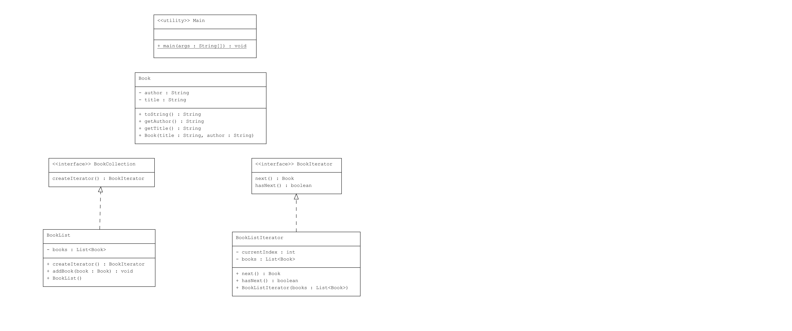

# Iterator Pattern : Kitap Koleksiyonu

Bu proje, Java'da Iterator Pattern kullanarak bir kitap koleksiyonunu iterasyon ile gezmeyi göstermektedir.

## Örnek Senaryo

Bu örnekte:
- **Book**: Kitapları temsil eden sınıf, başlık ve yazar bilgilerini içerir.
- **BookIterator**: Kitap koleksiyonları üzerinde iterasyon yapabilen arayüz.
- **BookCollection**: Kitap koleksiyonlarını temsil eden arayüz.
- **BookList**: Kitapları saklayan ve `BookIterator` sağlayan sınıf.
- **BookListIterator**: `BookList` koleksiyonu üzerinde iterasyon yapabilen sınıf.
- **Main**: Kitapları listeleyen ve `BookIterator` kullanarak koleksiyonu gezinen uygulama.

## Uml Diagram


---
## Kod Yapısı

Tüm sınıflar `src/` dizini altında bulunmaktadır.

### 1. `Book` Sınıfı

Dosya: `src/Book.java`

`Book` sınıfı, bir kitabın başlık ve yazar bilgilerini içerir. Ayrıca kitabın bilgilerini yazdırmak için `toString()` metodunu içerir.

### 2. `BookIterator` Arayüzü

Dosya: `src/BookIterator.java`

`BookIterator` arayüzü, kitap koleksiyonları üzerinde iterasyon yapabilmek için `hasNext()` ve `next()` metodlarını tanımlar.

### 3. `BookCollection` Arayüzü

Dosya: `src/BookCollection.java`

`BookCollection` arayüzü, kitap koleksiyonlarını tanımlar ve bir `BookIterator` nesnesi oluşturmayı sağlar.

### 4. `BookList` Sınıfı

Dosya: `src/BookList.java`

`BookList` sınıfı, kitapları saklar ve `BookIterator` sağlayan bir koleksiyon sınıfıdır. Kitap eklemek için `addBook()` metodunu ve bir iteratör oluşturmak için `createIterator()` metodunu içerir.

### 5. `BookListIterator` Sınıfı

Dosya: `src/BookListIterator.java`

`BookListIterator` sınıfı, `BookList` koleksiyonunu iterasyon yapabilen bir sınıftır. `hasNext()` ve `next()` metodları, koleksiyondaki kitapları sırayla almak için kullanılır.

### 6. `Main` Sınıfı

Dosya: `src/Main.java`

`Main` sınıfı, `BookList` sınıfını kullanarak kitapları ekler ve `BookIterator` kullanarak kitap koleksiyonunu gezip sonuçları ekrana yazdırır.

### Kod Çıktısı

Program çalıştırıldığında aşağıdaki gibi bir çıktı elde edilir:

```plaintext
Book [Title=The Catcher in the Rye, Author=J.D. Salinger]
Book [Title=To Kill a Mockingbird, Author=Harper Lee]
Book [Title=1984, Author=George Orwell]
```

### Açıklama

`Iterator Pattern`, bir koleksiyonun elemanlarına erişim sağlarken koleksiyonun iç yapısını gizler. Bu örnekte, bir `BookList` koleksiyonunu sıralı bir şekilde gezmek için Iterator Pattern kullanılmıştır.

## Lisans

Bu proje [MIT Lisansı](LICENSE) altında lisanslanmıştır.
