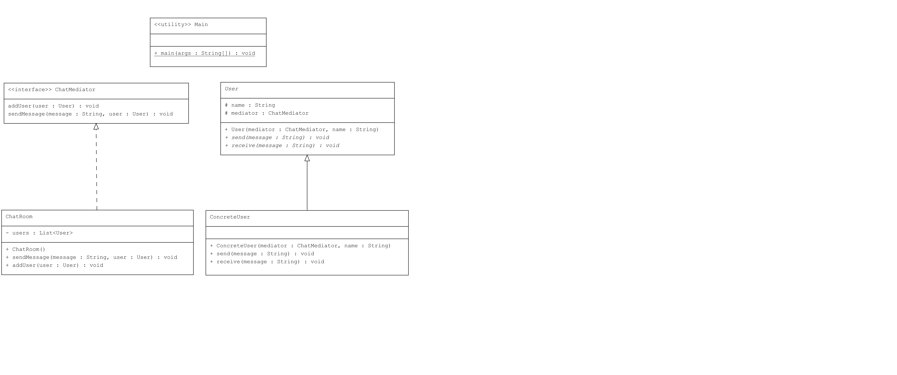

# Mediator Pattern : Chat Uygulaması

Bu proje, Java'da Mediator Pattern kullanarak bir chat uygulamasının nasıl çalıştığını göstermektedir.

## Örnek Senaryo

Bu örnekte:
- **ChatMediator**: Mediator arayüzü, mesaj gönderme ve kullanıcı ekleme işlevlerini tanımlar.
- **User**: Kullanıcıları temsil eden soyut sınıf. Mesaj gönderme ve alma metodlarını içerir.
- **ConcreteUser**: `User` sınıfını genişleten gerçek kullanıcı sınıfı. Mesaj gönderir ve alır.
- **ChatRoom**: `ChatMediator` arayüzünü uygulayan ve kullanıcılar arasındaki iletişimi yöneten sınıf.
- **Main**: `ChatRoom` kullanarak kullanıcıları oluşturur ve mesaj alışverişini simüle eder.

## UMl Diagram

---
## Kod Yapısı

Tüm sınıflar `src/` dizini altında bulunmaktadır.

### 1. `ChatMediator` Arayüzü

Dosya: `src/ChatMediator.java`

`ChatMediator` arayüzü, mesaj gönderme ve kullanıcı ekleme işlevlerini tanımlar.

### 2. `User` Sınıfı

Dosya: `src/User.java`

`User` sınıfı, bir kullanıcının mesaj gönderme ve alma işlemlerini tanımlar. Mesaj gönderme ve alma metodlarını içerir.

### 3. `ConcreteUser` Sınıfı

Dosya: `src/ConcreteUser.java`

`ConcreteUser` sınıfı, `User` sınıfını genişletir ve gerçek mesaj gönderme ve alma işlevlerini uygular.

### 4. `ChatRoom` Sınıfı

Dosya: `src/ChatRoom.java`

`ChatRoom` sınıfı, `ChatMediator` arayüzünü uygulayarak kullanıcılar arasındaki iletişimi yönetir ve mesajları iletir.

### 5. `Main` Sınıfı

Dosya: `src/Main.java`

`Main` sınıfı, `ChatRoom` sınıfını kullanarak kullanıcıları oluşturur ve mesaj alışverişini simüle eder.

### Kod Çıktısı

Program çalıştırıldığında aşağıdaki gibi bir çıktı elde edilir:

```plaintext
Alice sending: Hello everyone!
Alice received: Hello everyone!
Bob received: Hello everyone!
Charlie received: Hello everyone!
Bob sending: Hi Alice!
Alice received: Hi Alice!
Charlie received: Hi Alice!
Charlie sending: Hello Bob and Alice!
Alice received: Hello Bob and Alice!
Bob received: Hello Bob and Alice!
```

### Açıklama

`Mediator Pattern`, nesneler arasındaki iletişimi merkezi bir aracıyı kullanarak yönetir ve nesneler arasındaki doğrudan bağlantıları azaltır. Bu örnekte `ChatRoom` sınıfı, kullanıcılar arasındaki iletişimi yönetir.

## Lisans

Bu proje [MIT Lisansı](LICENSE) altında lisanslanmıştır.
