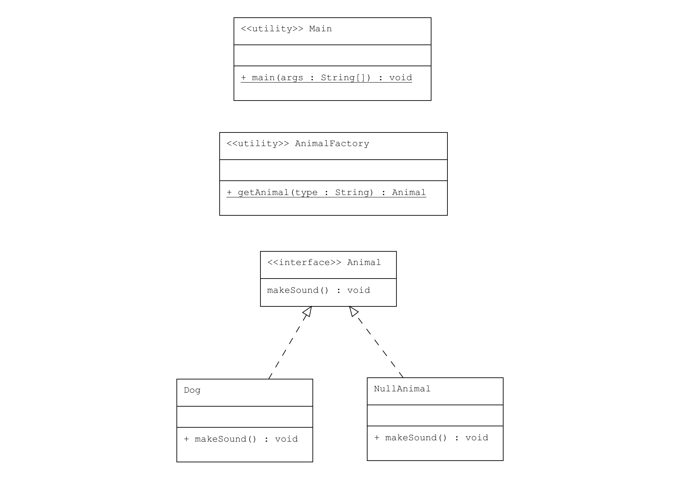

# Null Object Pattern : Boş Nesne Kullanımı

Bu proje, Java'da Null Object Pattern kullanarak bir nesnenin null kontrolü yapmadan nasıl boş bir nesne döndürülebileceğini göstermektedir.

## Örnek Senaryo

Bu örnekte:
- **Animal**: Hayvanların ses çıkarma davranışını tanımlayan bir arayüz.
- **Dog**: `Animal` arayüzünü uygulayan ve "Woof!" sesi çıkaran gerçek bir nesne.
- **NullAnimal**: `Animal` arayüzünü uygulayan ve herhangi bir işlem yapmayan bir boş nesne.
- **AnimalFactory**: Hayvan nesnelerini oluşturan fabrika sınıfı. Eğer tanımlı bir hayvan türü yoksa `NullAnimal` nesnesi döner.
- **Main**: `AnimalFactory` kullanarak hayvan nesnelerini oluşturur ve ses çıkarmalarını sağlar.

## UML Diagram


---
## Kod Yapısı

Tüm sınıflar `src/` dizini altında bulunmaktadır.

### 1. `Animal` Arayüzü

Dosya: `src/Animal.java`

`Animal` arayüzü, hayvanların ses çıkarma davranışını tanımlar ve `makeSound()` metodunu içerir.

### 2. `Dog` Sınıfı

Dosya: `src/Dog.java`

`Dog` sınıfı, `Animal` arayüzünü uygulayan bir sınıftır ve "Woof!" sesi çıkarır.

### 3. `NullAnimal` Sınıfı

Dosya: `src/NullAnimal.java`

`NullAnimal` sınıfı, `Animal` arayüzünü uygulayan ve herhangi bir işlem yapmayan bir sınıftır. Boş nesne olarak kullanılır ve null referansların neden olabileceği hataları önler.

### 4. `AnimalFactory` Sınıfı

Dosya: `src/AnimalFactory.java`

`AnimalFactory` sınıfı, hayvan nesnelerini oluşturan bir fabrika sınıfıdır. Eğer tanımlı bir hayvan türü yoksa, bir `NullAnimal` nesnesi döner.

### 5. `Main` Sınıfı

Dosya: `src/Main.java`

`Main` sınıfı, `AnimalFactory` kullanarak hayvan nesnelerini oluşturur ve ses çıkarmalarını sağlar.

### Kod Çıktısı

Program çalıştırıldığında aşağıdaki gibi bir çıktı elde edilir:

```plaintext
Woof!
```

Bu çıktıda, `Dog` nesnesi "Woof!" sesi çıkarırken, `NullAnimal` nesnesi hiçbir ses çıkarmaz.

### Açıklama

`Null Object Pattern`, bir nesneye null referansı döndürmek yerine boş bir nesne döndürerek null kontrollerini ve boş nesne hatalarını önler. Bu örnekte, eğer bir hayvan türü tanımlı değilse `NullAnimal` nesnesi döner ve herhangi bir işlem yapılmadan devam edilir.

## Lisans

Bu proje [MIT Lisansı](LICENSE) altında lisanslanmıştır.
