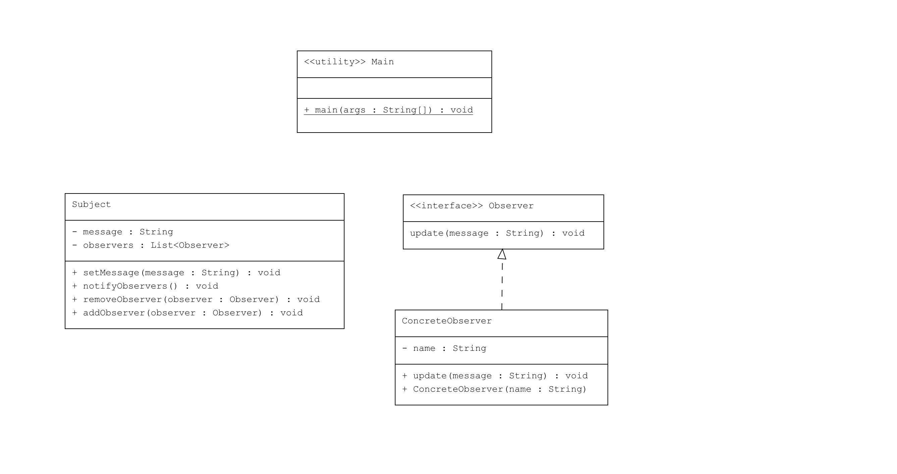

# Observer Pattern 

Observer Pattern, bir nesne (Subject) üzerinde bir değişiklik meydana geldiğinde, bağlı nesneleri (Observer) otomatik olarak bildirmek için kullanılır. Bu tasarım deseni, bir yayıncı-abone ilişkisini temsil eder ve bir olayı dinleyen birden fazla gözlemcinin olduğu durumlarda faydalıdır.

## Örnek Senaryo

Bu örnekte:
- **Observer**: Gözlemci arayüzü, bir güncelleme mesajını almak için `update()` metodunu tanımlar.
- **Subject**: Gözlemlenen sınıf, gözlemcileri eklemek ve çıkarmak için metodlar sağlar ve bir mesaj değiştiğinde gözlemcilere bildirim gönderir.
- **ConcreteObserver**: Gerçek gözlemciler, Observer arayüzünü uygulayan sınıflardır ve bir mesaj aldıklarında nasıl tepki vereceklerini tanımlarlar.
- **Main**: Gözlemcileri ekleyip mesaj göndererek gözlemci-publisher ilişkisini test eder.

## UML Diagram

---
## Kod Yapısı

Tüm sınıflar `src/` dizini altında bulunmaktadır.

### 1. `Observer` Arayüzü

Dosya: `src/Observer.java`

Observer arayüzü, gözlemcilerin uygulayacağı `update()` metodunu içerir.

### 2. `Subject` Sınıfı

Dosya: `src/Subject.java`

Subject sınıfı, gözlemcileri yönetmek için `addObserver()` ve `removeObserver()` metodlarını sağlar ve mesaj değişiklikleri olduğunda `notifyObservers()` metoduyla gözlemcileri bilgilendirir.

### 3. `ConcreteObserver` Sınıfı

Dosya: `src/ConcreteObserver.java`

ConcreteObserver sınıfı, `Observer` arayüzünü uygular ve mesaj alındığında bir mesajı konsola yazdırır.

### 4. Kullanım (Client)

Dosya: `src/Main.java`

Main sınıfı, gözlemci listesini oluşturur ve mesaj değişiklikleri olduğunda gözlemcilere bildirim gönderir.

### Kod Çıktısı

Program çalıştırıldığında aşağıdaki çıktıyı üretir:

```plaintext
Observer Observer 1 received message: Hello Observers!
Observer Observer 2 received message: Hello Observers!
Observer Observer 1 received message: Observer Pattern Example
Observer Observer 2 received message: Observer Pattern Example
```

## Açıklama

Observer Pattern, bir nesne bir olayda tetiklendiğinde, diğer nesnelere otomatik olarak bildirim göndermenin etkili bir yoludur. Bu desen, nesneler arasında gevşek bağlılık sağlar ve istemci kodunu basitleştirir.

## Lisans

Bu proje [MIT Lisansı](LICENSE) altında lisanslanmıştır.
