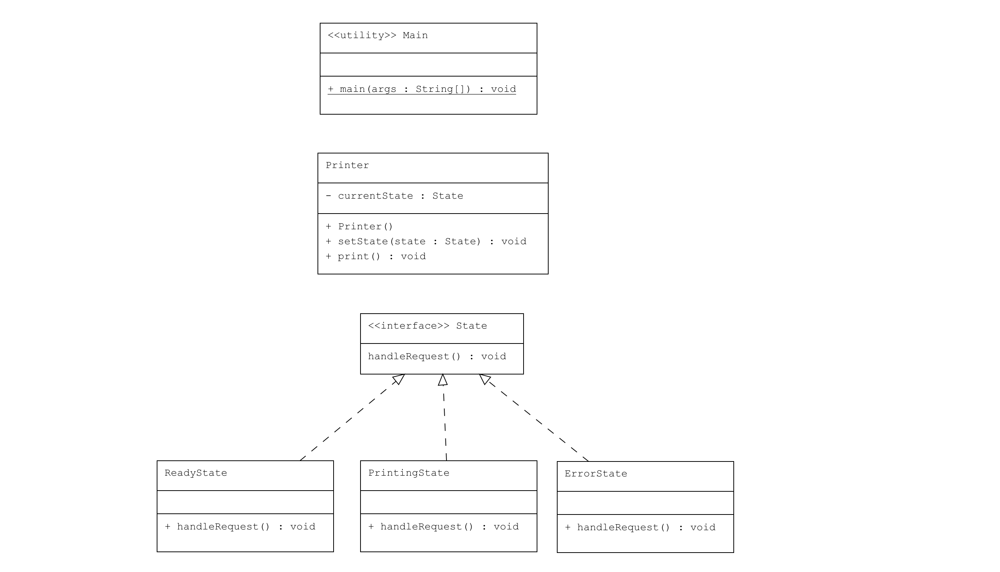

# State Pattern : Yazıcı (Printer) Durum Yönetimi

Bu proje, Java'da State Pattern kullanarak bir yazıcının (Printer) durumlarına göre davranışlarının nasıl değiştiğini gösteren bir uygulama içermektedir.

## Örnek Senaryo

Bu örnekte:
- **State**: Yazıcı için durumları tanımlayan bir arayüz.
- **ReadyState, PrintingState, ErrorState**: `State` arayüzünü uygulayan ve yazıcının farklı durumlarını temsil eden sınıflar.
- **Printer**: Yazıcının kendisini temsil eden ve mevcut duruma bağlı olarak davranış sergileyen sınıf.
- **Main**: Farklı yazıcı durumlarını ve davranışlarını gösteren bir sınıf.

## UML Diagram


## Kod Yapısı

Tüm sınıflar `src/` dizini altında bulunmaktadır.

### 1. `State` Arayüzü

Dosya: `src/State.java`

`State` arayüzü, yazıcının durumlarını tanımlayan `handleRequest()` metodunu içerir.

### 2. ConcreteState Sınıfları

Dosyalar: `src/ReadyState.java`, `src/PrintingState.java`, `src/ErrorState.java`

Bu sınıflar, `State` arayüzünü uygulayan ve yazıcının farklı durumlarını temsil eden sınıflardır. Her sınıf, `handleRequest()` metodunu kendi durumu için farklı şekilde uygular.

### 3. `Printer` Sınıfı

Dosya: `src/Printer.java`

`Printer` sınıfı, yazıcı nesnesini temsil eder ve durum yönetimini sağlar. `setState()` metodu ile yazıcının durumu değiştirilebilir ve `print()` metodu ile mevcut durumun davranışı sergilenir.

### 4. Kullanım (Client)

Dosya: `src/Main.java`

`Main` sınıfı, farklı yazıcı durumlarını ve bunların davranışlarını gösterir.

### Kod Çıktısı

Program çalıştırıldığında aşağıdaki gibi bir çıktı elde edilir:

```plaintext
Printer is ready to print.
Printer is currently printing...
Printer is in an error state!
```

Yukarıdaki çıktıda, yazıcı farklı durumlara geçtiğinde buna göre farklı çıktılar vermektedir.

## Açıklama

`State Pattern`, bir nesnenin iç durumuna göre davranışlarını değiştirmesini sağlar. Bu örnekte, `Printer` sınıfı mevcut duruma göre farklı davranışlar sergiler.

## Lisans

Bu proje [MIT Lisansı](LICENSE) altında lisanslanmıştır.
