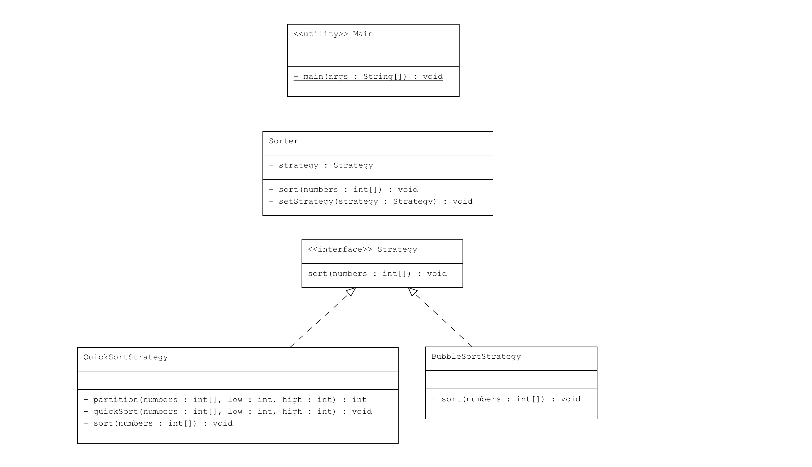

# Strategy Pattern : Farklı Sıralama Stratejileri

Bu proje, Java'da Strategy Pattern kullanarak bir listenin sıralanmasında farklı algoritmaların nasıl kullanılacağını gösteren bir uygulama içermektedir.

## Örnek Senaryo

Bu örnekte:
- **Strategy**: Sıralama stratejilerini tanımlayan bir arayüz.
- **BubbleSortStrategy, QuickSortStrategy**: `Strategy` arayüzünü uygulayan ve sıralama işlemini farklı şekillerde gerçekleştiren sınıflar.
- **Sorter**: Bir `Strategy` nesnesini kabul eden ve sıralama işlemini gerçekleştiren sınıf.
- **Main**: Farklı sıralama stratejilerini gösteren bir sınıf.

## UML Diagram


## Kod Yapısı

Tüm sınıflar `src/` dizini altında bulunmaktadır.

### 1. `Strategy` Arayüzü

Dosya: `src/Strategy.java`

`Strategy` arayüzü, bir listenin sıralanmasını tanımlayan `sort()` metodunu içerir.

### 2. ConcreteStrategy Sınıfları

Dosyalar: `src/BubbleSortStrategy.java`, `src/QuickSortStrategy.java`

Bu sınıflar, `Strategy` arayüzünü uygulayan ve sıralama işlemini kendi algoritmalarına göre gerçekleştiren sınıflardır. Her sınıf, `sort()` metodunu kendi algoritmasını kullanarak uygular.

### 3. `Sorter` Sınıfı

Dosya: `src/Sorter.java`

`Sorter` sınıfı, belirli bir sıralama stratejisi kullanarak listeyi sıralayan bir sınıftır. `setStrategy()` metodu ile sıralama stratejisi değiştirilebilir ve `sort()` metodu ile liste sıralanır.

### 4. Kullanım (Client)

Dosya: `src/Main.java`

`Main` sınıfı, farklı sıralama stratejilerini ve bunların nasıl çalıştığını gösterir.

### Kod Çıktısı

Program çalıştırıldığında aşağıdaki gibi bir çıktı elde edilir:

```plaintext
Sorting using Bubble Sort
Sorting using Quick Sort
```

Yukarıdaki çıktıda, liste farklı stratejiler kullanılarak sıralanmıştır.

## Açıklama

`Strategy Pattern`, bir nesnenin çalışma zamanında bir algoritmayı seçmesini sağlar. Bu örnekte, `Sorter` sınıfı farklı sıralama algoritmaları kullanarak listeyi sıralar.

## Lisans

Bu proje [MIT Lisansı](LICENSE) altında lisanslanmıştır.
