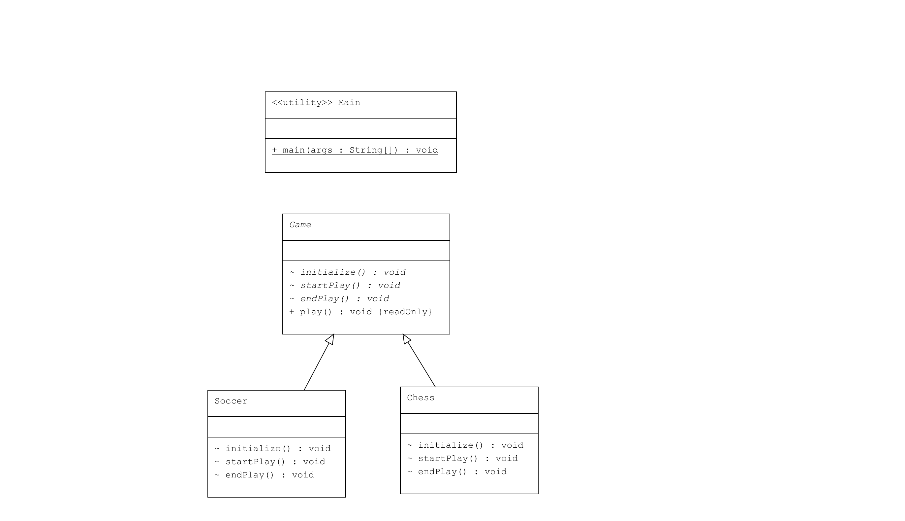

# Template Pattern : Oyun Şablonu

Bu proje, Java'da Template Pattern kullanarak bir oyun şablonu oluşturur ve farklı oyun türleri için bu şablonu uygular. Template Pattern, bir algoritmanın iskeletini tanımlar ve bazı adımlarını alt sınıfların gerçekleştirmesine olanak tanır.

## Örnek Senaryo

Bu örnekte:

- **Game**: Oyun adımlarını tanımlayan soyut bir sınıftır. Oyun adımları `initialize()`, `startPlay()`, ve `endPlay()` metodları ile tanımlanır.
- **Chess, Soccer**: `Game` sınıfını genişleten ve her oyunun spesifik kurallarını uygulayan somut sınıflardır.
- **Main**: Farklı oyun türlerini gösteren ve şablon metodunu kullanarak oyunları başlatan sınıftır.

## UML Diagram


## Kod Yapısı

Tüm sınıflar `src/` dizini altında bulunmaktadır.

### 1. Game Soyut Sınıfı

Dosya: `src/Game.java`

`Game` sınıfı, oyun adımlarını tanımlar ve `play()` metodunda bu adımları sıralı olarak çağırır. `initialize()`, `startPlay()`, ve `endPlay()` metodları soyut olup, her alt sınıfta uygulanması gerekir.

### 2. Concrete Class Sınıfları

Dosyalar: `src/Chess.java`, `src/Soccer.java`

Bu sınıflar, `Game` soyut sınıfını genişletir ve her oyunun spesifik kurallarını uygular. `initialize()`, `startPlay()`, ve `endPlay()` metodlarını oyun spesifik kurallarla gerçekleştirirler.

### 3. Kullanım (Client)

Dosya: `src/Main.java`

`Main` sınıfı, farklı oyun türlerini başlatır ve oyunların nasıl çalıştığını gösterir.

## Kod Çıktısı

Program çalıştırıldığında aşağıdaki gibi bir çıktı elde edilir:

```plaintext
Chess Game Initialized! Start playing.
Game Started. Welcome to Chess.
Game Finished!

Soccer Game Initialized! Start playing.
Game Started. Welcome to Soccer.
Game Finished!
```

Yukarıdaki çıktıda, farklı oyun türleri şablon metodunu kullanarak başlatılmıştır.

## Açıklama

`Template Pattern`, bir algoritmanın iskeletini tanımlar ve bazı adımlarını alt sınıfların gerçekleştirmesine olanak tanır. Bu örnekte, `Game` sınıfı oyun adımlarını tanımlar ve somut sınıflar bu adımları kendi kurallarına göre gerçekleştirir.

## Lisans

Bu proje [MIT Lisansı](LICENSE) altında lisanslanmıştır.
