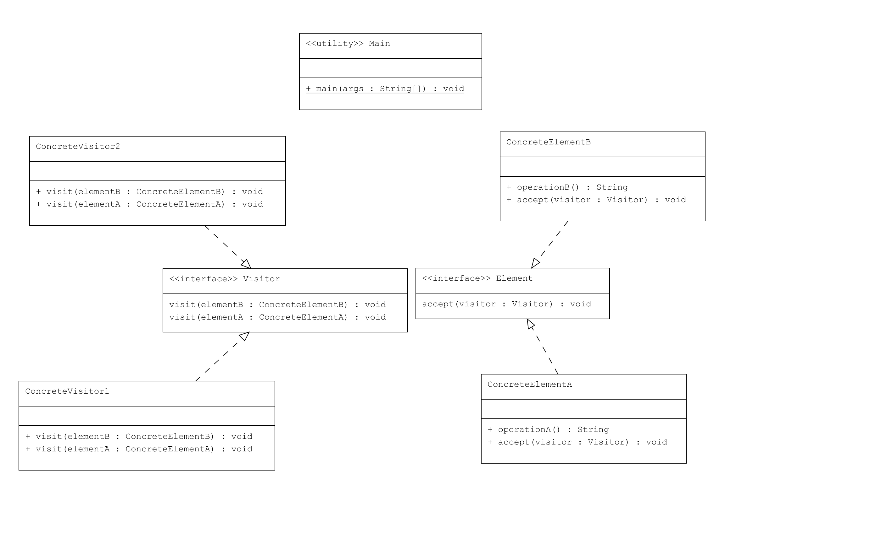

# Visitor Pattern : Farklı Ziyaretçiler

Bu proje, Java'da Visitor Pattern kullanarak farklı ziyaretçilerin bir dizi öğeyi nasıl ziyaret edebileceğini gösterir. Visitor Pattern, yeni operasyonlar eklemeyi kolaylaştırır ve mevcut öğe yapısını değiştirmeden ekleme yapmanıza olanak tanır.

## Örnek Senaryo

Bu örnekte:

- **Element**: Ziyaretçilerin ziyaret edebileceği öğelerin arayüzüdür.
- **Visitor**: Farklı ziyaretçilerin öğeleri ziyaret edebilmesi için arayüzdür.
- **ConcreteElementA, ConcreteElementB**: `Element` arayüzünü uygulayan ve `accept()` metodunu ziyaretçilere karşılık olarak çağıran somut sınıflardır.
- **ConcreteVisitor1, ConcreteVisitor2**: `Visitor` arayüzünü uygulayan ve farklı işlemler gerçekleştiren somut ziyaretçilerdir.
- **Main**: Farklı ziyaretçilerin öğeleri nasıl ziyaret ettiğini gösterir.

## UML Diagram


## Kod Yapısı

Tüm sınıflar `src/` dizini altında bulunmaktadır.

### 1. `Element` Arayüzü

Dosya: `src/Element.java`

`Element` arayüzü, ziyaretçilerin öğeyi ziyaret edebilmesi için `accept()` metodunu içerir.

### 2. `Visitor` Arayüzü

Dosya: `src/Visitor.java`

`Visitor` arayüzü, öğelerin ziyaret edilmesi gereken işlemleri tanımlar.

### 3. Somut `Element` Sınıfları

Dosyalar: `src/ConcreteElementA.java`, `src/ConcreteElementB.java`

Bu sınıflar, `Element` arayüzünü uygulayan ve `accept()` metodunu ziyaretçileri karşılamak üzere implement eden sınıflardır.

### 4. Somut `Visitor` Sınıfları

Dosyalar: `src/ConcreteVisitor1.java`, `src/ConcreteVisitor2.java`

Bu sınıflar, `Visitor` arayüzünü implement eder ve `visit()` metodunu kullanarak her `Element` türü üzerinde farklı işlemler gerçekleştirirler.

### 5. Kullanım (Client)

Dosya: `src/Main.java`

`Main` sınıfı, farklı ziyaretçilerin öğeleri nasıl ziyaret ettiğini gösterir.

## Kod Çıktısı

Program çalıştırıldığında aşağıdaki gibi bir çıktı elde edilir:

```plaintext
ConcreteVisitor1 visiting ConcreteElementA operation
ConcreteVisitor1 visiting ConcreteElementB operation

ConcreteVisitor2 visiting ConcreteElementA operation
ConcreteVisitor2 visiting ConcreteElementB operation
```

Yukarıdaki çıktıda, her ziyaretçi farklı öğeleri ziyaret ederek çeşitli işlemler gerçekleştirmiştir.

## Açıklama

`Visitor Pattern`, bir nesne yapısını değiştirmeden yeni operasyonlar eklemeyi sağlar. Bu örnekte, `ConcreteVisitor1` ve `ConcreteVisitor2` farklı `Element` türleri üzerinde çeşitli işlemler gerçekleştirir.

## Lisans

Bu proje [MIT Lisansı](LICENSE) altında lisanslanmıştır.
