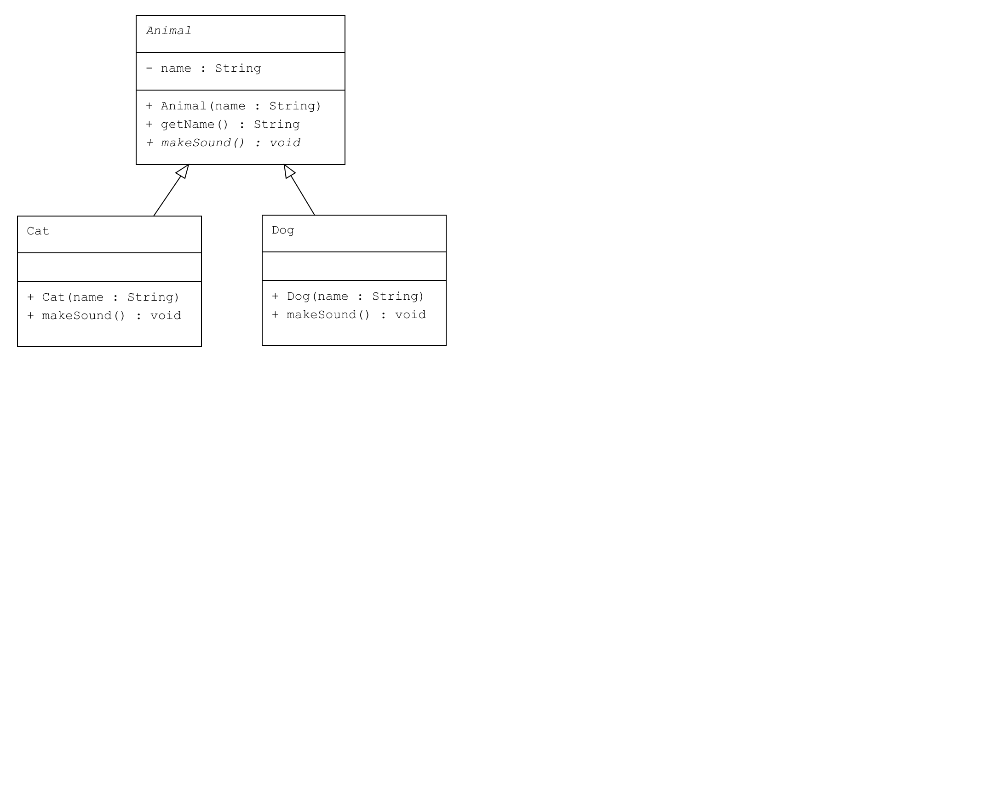

# Abstract Sınıf ve Metot: Hayvanlar

Bu proje, Java'da `abstract` sınıfların ve metotların nasıl kullanılacağını gösteren bir örnektir. Örnek, bir hayvanat bahçesindeki çeşitli hayvanları tanımlamak için `Animal` adlı bir abstract sınıf ve bu sınıftan türeyen somut hayvan sınıflarını içermektedir.

## Örnek Senaryo

Bu örnekte:
- **Animal**: Soyut sınıf olup, tüm hayvanların ortak özelliklerini ve davranışlarını tanımlar.
- **Dog** (Köpek) ve **Cat** (Kedi): `Animal` sınıfından türetilmiş somut sınıflardır. Her biri kendi `makeSound()` metodunu uygular.
- **Main**: Farklı hayvan nesneleri oluşturur ve ses çıkarma işlemlerini test eder.

---

## UML Diagram



## Kod Yapısı

Tüm sınıflar `src/` dizini altında bulunmaktadır.

### 1. `Animal` Abstract Sınıfı

Dosya: `src/Animal.java`

### 2. `Dog` Sınıfı

Dosya: `src/Dog.java`

### 3. `Cat` Sınıfı

Dosya: `src/Cat.java`

### 4. Kullanım (Client)

Dosya: `src/Main.java`

### Çıktı

```plaintext
Buddy says: Woof!
Whiskers says: Meow!
```

## Açıklama
- Animal: Soyut sınıf olup, name özelliğini ve makeSound() soyut metodunu içerir.
- Dog ve Cat: Animal sınıfından türetilmiş somut sınıflardır. makeSound() metodunu kendi türlerine uygun şekilde uygular.
- Main: Hayvan nesneleri oluşturur ve her birinin makeSound() metodunu çağırır.

---

## Lisans
Bu proje MIT Lisansı altında lisanslanmıştır.
