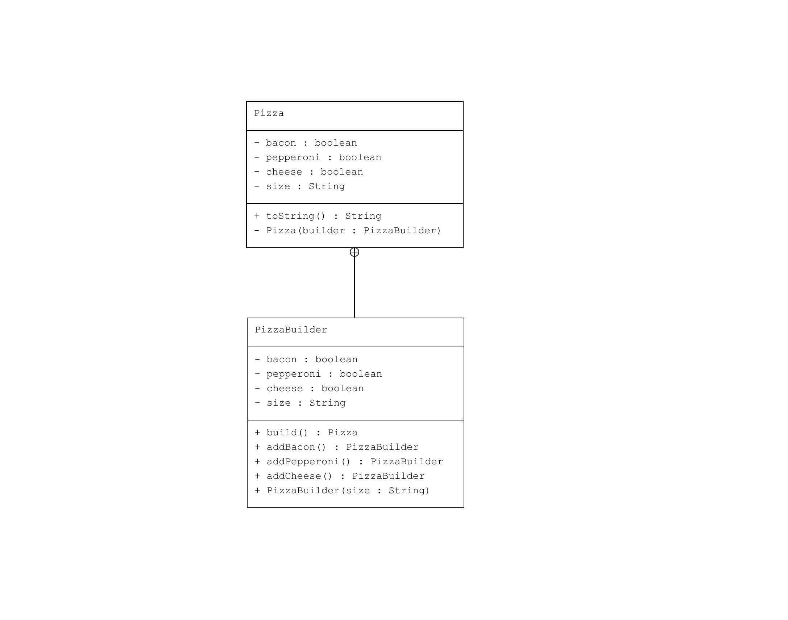

# Builder Pattern : Pizza

Bu proje, Java'da Builder Pattern'in nasıl kullanılacağını gösteren bir örnektir. Bu örnek, bir pizza nesnesinin adım adım nasıl oluşturulacağını gösterir.

## Örnek Senaryo

Bu örnekte:
- **Pizza**: Farklı özellikleri olan bir pizza nesnesini temsil eder.
- **PizzaBuilder**: `Pizza` nesnesini oluşturmak için kullanılan builder sınıfıdır.
- **Main**: `PizzaBuilder` kullanarak bir pizza nesnesi oluşturur ve sonucunu ekrana basar.

## UML Diagram

## Kod Yapısı

Tüm sınıflar `src/` dizini altında bulunmaktadır.

### 1. `Pizza` Sınıfı

Dosya: `src/Pizza.java`

Bu sınıf, pizza nesnesinin özelliklerini ve `PizzaBuilder` sınıfını içerir.

### 2. Kullanım (Client)

Dosya: `src/Main.java`

Bu sınıf, `PizzaBuilder` sınıfını kullanarak bir pizza nesnesi oluşturur ve ekrana yazdırır.

### Çıktı

```plaintext
Pizza [size=Large, cheese=true, pepperoni=true, bacon=false]
```

### Açıklama
- Pizza: Pizza nesnesinin özelliklerini ve builder sınıfını içerir.
- PizzaBuilder: Pizza nesnesini oluşturmak için kullanılan builder sınıfıdır. Farklı özellikleri adım adım ekleyebiliriz.
- Main: Builder sınıfını kullanarak pizza nesnesi oluşturur ve sonuçları ekrana basar.
---
## Lisans
Bu proje MIT Lisansı altında lisanslanmıştır.