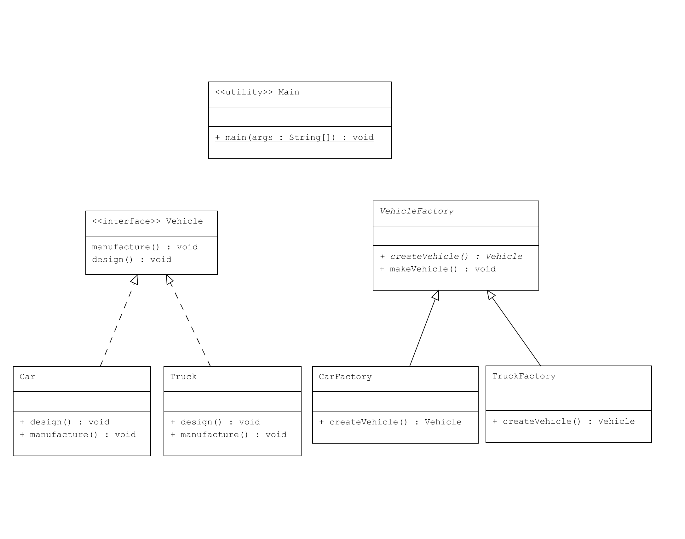

# Factory Method Pattern

Bu proje, `Factory Method Pattern`'in Java'da nasıl uygulanacağını gösteren bir örnek sunmaktadır. Örnek, bir araç üretim sistemi üzerine kurgulanmıştır ve `Car` ve `Truck` gibi farklı türde araç nesnelerinin üretilmesini sağlar.

## Design Pattern: Factory Method

**Factory Method Pattern**, nesne oluşturma işlemini bir alt sınıfa bırakmayı sağlayan bir tasarım desenidir. Bu desen, bir sınıfın, kendi alt sınıflarına hangi sınıfın örneğinin oluşturulacağını belirleme yetkisi verdiği bir "fabrika" metodunu tanımlar.

### Örnek Senaryo

Bu örnekte, araç üretim sisteminde iki tür araç üretilmektedir:
- **Car (Araba)**
- **Truck (Kamyon)**

Her iki araç türü de `Vehicle` arayüzünü uygular ve kendilerine özgü üretim süreçlerini içerir.

## UML Diyagramı

Aşağıda, `Factory Method Pattern`'in UML diyagramı bulunmaktadır:



## Kod Yapısı

### 1. Ürün Arayüzü (Product Interface)

Dosya: `src/Vehicle.java`

### 2. Somut Ürün Sınıfları (Concrete Product Classes)

Dosyalar:
- `src/Car.java`
- `src/Truck.java`

### 3. Fabrika Arayüzü (Factory Interface)

Dosya: `src/VehicleFactory.java`

### 4. Somut Fabrika Sınıfları (Concrete Factory Classes)

Dosyalar:
- `src/CarFactory.java`
- `src/TruckFactory.java`

### 5. Kullanım (Client)

Dosya: `src/Main.java`

### Çıktı

```plaintext
Designing Car
Manufacturing Car
Designing Truck
Manufacturing Truck
```

## Açıklama

- Vehicle: Araçların ortak arayüzü olup, design() ve manufacture() metodlarını tanımlar.
- Car ve Truck: Vehicle arayüzünü uygular ve kendi design() ve manufacture() metodlarını sağlar.
- VehicleFactory: Araç fabrikasının temel sınıfıdır ve createVehicle() metodunu soyut olarak tanımlar.
- CarFactory ve TruckFactory: VehicleFactory sınıfından türetilir ve createVehicle() metodunu uygular.
- Main: Fabrika sınıflarını kullanarak araçların yaratılmasını ve işlenmesini gösterir.

---

### Lisans
Bu proje MIT Lisansı altında lisanslanmıştır.
