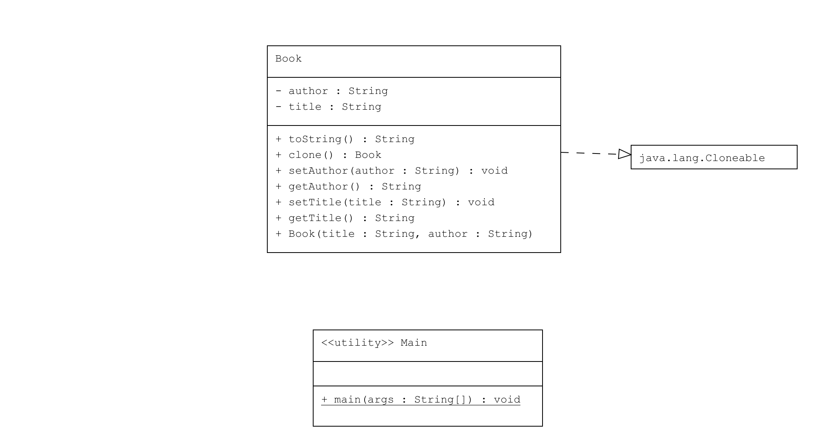

# Prototype Pattern : Kitap

Bu proje, Java'da Prototype Pattern'in nasıl kullanılacağını gösteren bir örnektir. Bu örnek, bir kitabın nasıl klonlanacağını ve bu klonlama işleminin nasıl yapılacağını gösterir.

## Örnek Senaryo

Bu örnekte:
- **Book**: Klonlanabilir bir sınıftır. Kitap başlığı ve yazar bilgilerini içerir ve `clone()` metodunu kullanarak bir kopyasını oluşturabilir.
- **Main**: `Book` nesnesinin nasıl klonlanacağını ve klonlanmış nesnenin orijinal nesne ile nasıl karşılaştırılacağını gösterir.

---
## UML Diagram

---
## Kod Yapısı

Tüm sınıflar `src/` dizini altında bulunmaktadır.

### 1. `Book` Sınıfı

Dosya: `src/Book.java`

Bu sınıf, `Cloneable` arayüzünü implement eder. `Cloneable` arayüzü, Java'da bir nesnenin klonlanmasını destekleyen bir işaretçi arayüzüdür. Bu arayüzü implement eden sınıflar, `Object` sınıfından miras alınan `clone()` metodunu kullanarak nesnelerin kopyalarını oluşturabilir.

### 2. Kullanım (Client)

Dosya: `src/Main.java`

Bu sınıf, `Book` nesnesinin klonlanmasını ve orijinal ile klonlanmış nesnelerin farklı özelliklere sahip olduğunu gösterir.

### Çıktı

Program çalıştırıldığında aşağıdaki gibi bir çıktı elde edilir:

```plaintext
Original Book: Book [title=Design Patterns, author=Erich Gamma]
Cloned Book: Book [title=Design Patterns (Updated), author=Erich Gamma]
```

## Cloneable Arayüzü
Cloneable arayüzü, Java'da nesne klonlamayı desteklemek için kullanılan bir işaretçi arayüzüdür. Bu arayüzü implement eden sınıflar, Object sınıfından miras alınan clone() metodunu kullanarak nesnelerin kopyalarını oluşturabilir. Ancak, Cloneable arayüzü sadece bir işaretçidir ve klonlama işleminin nasıl yapılacağını belirlemez. clone() metodunun özelleştirilmesi gerekir.

- Cloneable: Bir nesnenin klonlanmasını destekleyen işaretçi arayüzüdür.
- clone() Metodu: Object sınıfında tanımlıdır ve nesnenin yüzeysel (shallow) kopyasını oluşturur. Eğer bir sınıf Cloneable arayüzünü implement etmiyorsa ve clone() metodu çağrılırsa, CloneNotSupportedException istisnası atılır.
- Yüzeysel Klonlama (Shallow Cloning): Sadece nesnenin temel özelliklerinin kopyasını yapar. İç içe geçmiş nesneler hala aynı referansa işaret eder.
- Derin Klonlama (Deep Cloning): İç içe geçmiş nesneleri de klonlar ve tamamen bağımsız iki nesne elde edilir.
---
## Açıklama
- Book: Kitap nesnesinin başlık ve yazar bilgilerini içerir ve clone() metodu ile klonlanabilir.
- Main: Orijinal bir kitap nesnesi oluşturur ve bu nesneyi klonlayarak başlığını değiştirir. Sonuç olarak, orijinal ve klonlanmış kitap nesnelerini karşılaştırır.
---
## Lisans
Bu proje MIT Lisansı altında lisanslanmıştır.