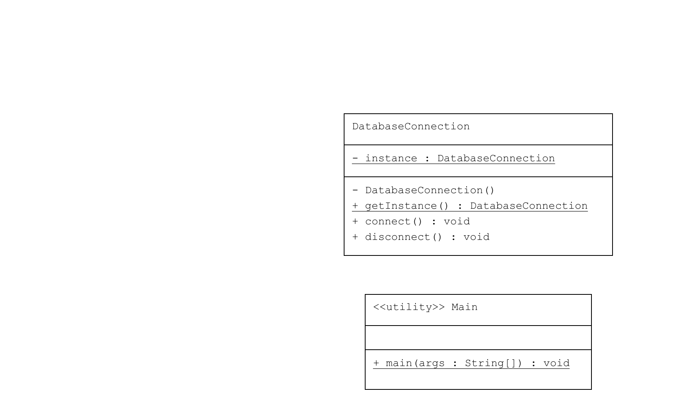

# Singleton Pattern Örneği: Veritabanı Bağlantısı

Bu proje, Java'da Singleton Pattern'in nasıl kullanılacağını gösteren bir örnektir. Bu örnek, bir veritabanı bağlantısı nesnesinin yalnızca bir örneğinin nasıl oluşturulacağını ve bu örneğe nasıl erişileceğini gösterir.

## Örnek Senaryo

Bu örnekte:
- **DatabaseConnection**: Singleton sınıfıdır ve yalnızca bir örneği oluşturulur. Bu sınıf, veritabanı bağlantısını temsil eder.
- **Main**: Singleton sınıfının nasıl kullanılacağını ve iki referansın aynı örneğe işaret ettiğini gösterir.

## UML Diagram

---
## Kod Yapısı

Tüm sınıflar `src/` dizini altında bulunmaktadır.

### 1. `DatabaseConnection` Sınıfı

Dosya: `src/DatabaseConnection.java`

Bu sınıf, Singleton Pattern'i uygulayan ve veritabanı bağlantısı sağlayan sınıftır.

### 2. Kullanım (Client)

Dosya: `src/Main.java`

Bu sınıf, Singleton sınıfını kullanarak bir veritabanı bağlantısı oluşturur ve bu bağlantının yalnızca bir örneği olduğunu doğrular.

### Çıktı

```plaintext
Connected to the database.
Disconnected from the database.
Are both connections the same instance? true
```

## Açıklama
- DatabaseConnection: Singleton sınıfıdır. getInstance() metodu, sınıfın tek örneğine global erişim sağlar ve bu örneği oluşturur.
- Main: Singleton sınıfının nasıl kullanılacağını gösterir. İki farklı referansın aynı örneğe işaret ettiğini doğrular.
---
- Lisans
Bu proje MIT Lisansı altında lisanslanmıştır.
