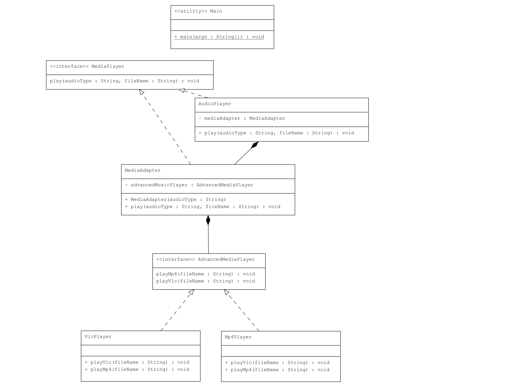

# Adapter Pattern Örneği: Medya Oynatıcı

Bu proje, Java'da Adapter Pattern kullanarak farklı türde medya dosyalarını oynatabilen bir medya oynatıcı uygulamasını göstermektedir.

## Örnek Senaryo

Bu örnekte:
- **MediaPlayer**: Sadece `mp3` dosyalarını oynatabilen bir arayüz.
- **AdvancedMediaPlayer**: `mp4` ve `vlc` türündeki medya dosyalarını oynatabilen bir arayüz.
- **Mp4Player ve VlcPlayer**: `AdvancedMediaPlayer` arayüzünü uygulayan ve kendi formatlarına uygun medya dosyalarını oynatan sınıflar.
- **MediaAdapter**: `MediaPlayer` arayüzünü uygulayan ve `AdvancedMediaPlayer` türündeki nesneler için adaptör görevi gören sınıf.
- **AudioPlayer**: `MediaPlayer` arayüzünü uygulayan ve `mp3` dosyalarını doğrudan oynatabilen bir sınıf. Diğer formatları oynatmak için `MediaAdapter` kullanır.

## Uml Diagram


## Kod Yapısı

Tüm sınıflar `src/` dizini altında bulunmaktadır.

### 1. `MediaPlayer` Arayüzü

Dosya: `src/MediaPlayer.java`

`MediaPlayer` arayüzü, yalnızca `mp3` dosyalarını oynatabilir. Bu arayüz, `play()` metodunu tanımlar.

### 2. `AdvancedMediaPlayer` Arayüzü

Dosya: `src/AdvancedMediaPlayer.java`

`AdvancedMediaPlayer` arayüzü, `mp4` ve `vlc` formatlarında medya dosyalarını oynatmak için gerekli metodları tanımlar.

### 3. `Mp4Player` ve `VlcPlayer` Sınıfları

Dosyalar: `src/Mp4Player.java`, `src/VlcPlayer.java`

Bu sınıflar, `AdvancedMediaPlayer` arayüzünü uygulayan ve kendi formatlarına uygun medya dosyalarını oynatan sınıflardır.

### 4. `MediaAdapter` Sınıfı

Dosya: `src/MediaAdapter.java`

`MediaAdapter` sınıfı, `MediaPlayer` arayüzünü uygulayan ve `AdvancedMediaPlayer` türündeki nesneler için adaptör görevi gören bir sınıftır. Böylece `AudioPlayer`, `mp4` ve `vlc` formatlarını da oynatabilir.

### 5. `AudioPlayer` Sınıfı

Dosya: `src/AudioPlayer.java`

`AudioPlayer` sınıfı, `MediaPlayer` arayüzünü uygulayan ve `mp3` dosyalarını doğrudan oynatabilen bir sınıftır. Diğer formatları oynatmak için ise `MediaAdapter` kullanır.

### 6. Kullanım (Client)

Dosya: `src/Main.java`

`Main` sınıfı, `AudioPlayer` nesnesi oluşturarak farklı türde medya dosyalarını oynatmayı gösterir.

### Kod Çıktısı

Program çalıştırıldığında aşağıdaki gibi bir çıktı elde edilir:

```plaintext
Playing mp3 file: song.mp3
Playing mp4 file: movie.mp4
Playing vlc file: video.vlc
Invalid media. avi format not supported
```

Yukarıdaki çıktıda, `mp3`, `mp4` ve `vlc` dosyaları başarıyla oynatılırken, desteklenmeyen bir format olan `avi` dosyası için hata mesajı döner.

## Açıklama

`Adapter Pattern`, mevcut bir sınıfın arayüzünü, beklenen bir arayüze dönüştürerek uyumluluk sağlar. Bu örnekte `MediaAdapter` sınıfı, `MediaPlayer` arayüzünü `AdvancedMediaPlayer` arayüzü ile uyumlu hale getiren adaptör görevi görür.

## Lisans

Bu proje [MIT Lisansı](LICENSE) altında lisanslanmıştır.
