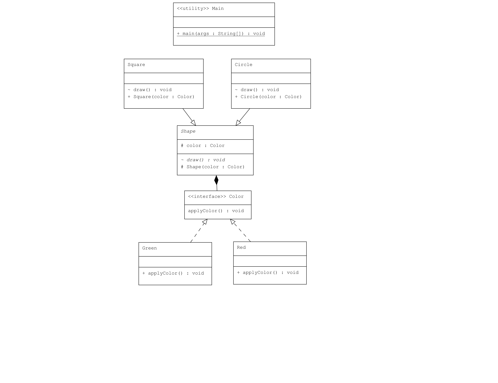

# Bridge Pattern : Şekil ve Renk Uygulaması

Bu proje, Java'da Bridge Pattern kullanarak şekil ve renklerin bağımsız olarak genişletilebilmesini gösteren bir uygulama içermektedir.

## Örnek Senaryo

Bu örnekte:
- **Color**: Renkleri tanımlayan bir arayüz.
- **Red ve Green**: `Color` arayüzünü uygulayan ve kendi renklerini uygulayan sınıflar.
- **Shape**: Şekilleri tanımlayan soyut sınıf. Bir `Color` nesnesi kullanarak bir şeklin nasıl çizileceğini belirtir.
- **Circle ve Square**: `Shape` sınıfını genişleten ve kendi şekillerini çizen sınıflar.

## Uml Diagram


## Kod Yapısı

Tüm sınıflar `src/` dizini altında bulunmaktadır.

### 1. `Color` Arayüzü

Dosya: `src/Color.java`

`Color` arayüzü, bir rengin nasıl uygulanacağını tanımlayan `applyColor()` metodunu içerir.

### 2. `Red` ve `Green` Sınıfları

Dosyalar: `src/Red.java`, `src/Green.java`

Bu sınıflar, `Color` arayüzünü uygulayan ve kendi renklerini uygulayan sınıflardır. Her sınıf, `applyColor()` metodunu kendi rengini uygulayacak şekilde tanımlar.

### 3. `Shape` Soyut Sınıfı

Dosya: `src/Shape.java`

`Shape` sınıfı, bir şeklin nasıl çizileceğini tanımlayan soyut bir sınıftır. Bu sınıf, bir `Color` nesnesini kullanarak rengin nasıl uygulanacağını belirtir.

### 4. `Circle` ve `Square` Sınıfları

Dosyalar: `src/Circle.java`, `src/Square.java`

Bu sınıflar, `Shape` sınıfını genişleten ve kendi şekillerini çizen sınıflardır. Her sınıf, `draw()` metodunu kullanarak kendi şekillerini çizer ve rengi uygular.

### 5. Kullanım (Client)

Dosya: `src/Main.java`

`Main` sınıfı, farklı şekiller ve renkler oluşturur ve bunların nasıl çizileceğini gösterir.

### Kod Çıktısı

Program çalıştırıldığında aşağıdaki gibi bir çıktı elde edilir:

```plaintext
Drawing Circle with color Applying red color
Drawing Square with color Applying green color
```

Yukarıdaki çıktıda, bir `Circle` kırmızı renkte ve bir `Square` yeşil renkte çizilir.

## Açıklama

`Bridge Pattern`, soyutlama ile implementasyonu birbirinden ayırarak ikisinin bağımsız olarak genişletilebilmesini sağlar. Bu örnekte `Shape` sınıfı ve `Color` arayüzü birbirinden bağımsız bir şekilde genişletilmiştir.

## Lisans

Bu proje [MIT Lisansı](LICENSE) altında lisanslanmıştır.
