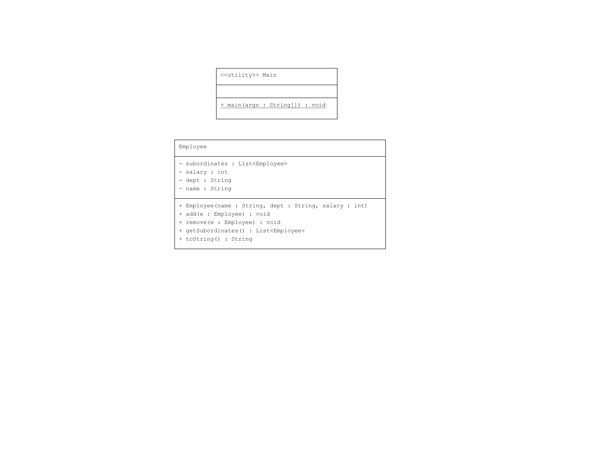

# Composite Pattern : Şirket Çalışanları

Bu proje, Java'da Composite Pattern kullanarak bir şirketin çalışanlarının hiyerarşik yapısını gösteren bir uygulamayı içermektedir.

## Örnek Senaryo

Bu örnekte:
- **Employee**: Çalışan sınıfı, bir çalışanın temel bilgilerini (ad, departman, maaş) içerir ve bu sınıf aynı zamanda başka çalışanları da içerebilen bir yapıya sahiptir.
- **Main**: Çalışanlar arasındaki ilişkileri tanımlayan ve hiyerarşiyi ekrana yazdıran bir sınıftır.

## Uml Diagram


## Kod Yapısı

Tüm sınıflar `src/` dizini altında bulunmaktadır.

### 1. `Employee` Sınıfı

Dosya: `src/Employee.java`

`Employee` sınıfı, bir çalışanın bilgilerini (ad, departman, maaş) saklar ve alt çalışanları (subordinates) liste olarak tutar. Bu sınıf:
- `add(Employee e)`: Alt çalışan ekler.
- `remove(Employee e)`: Alt çalışanı çıkarır.
- `getSubordinates()`: Alt çalışanları döndürür.

### 2. Kullanım (Client)

Dosya: `src/Main.java`

`Main` sınıfı, şirket hiyerarşisini oluşturan bir ana sınıftır. Bu sınıf, çalışanların eklenmesi ve hiyerarşik yapının ekrana yazdırılması işlemlerini yapar.

### Kod Çıktısı

Program çalıştırıldığında aşağıdaki gibi bir çıktı elde edilir:

```plaintext
Employee :[ Name : John, Dept : CEO, Salary : 30000 ]
Employee :[ Name : Robert, Dept : Head Sales, Salary : 20000 ]
Employee :[ Name : Richard, Dept : Sales, Salary : 10000 ]
Employee :[ Name : Rob, Dept : Sales, Salary : 10000 ]
Employee :[ Name : Michel, Dept : Head Marketing, Salary : 20000 ]
Employee :[ Name : Laura, Dept : Marketing, Salary : 10000 ]
Employee :[ Name : Bob, Dept : Marketing, Salary : 10000 ]
```

Yukarıdaki çıktıda, `CEO` ve onun altındaki çalışanlar hiyerarşik bir şekilde listelenmiştir.

## Açıklama

`Composite Pattern`, nesneleri ağaç yapısında organize ederek bir nesne grubunu tek bir nesne gibi işlemenizi sağlar. Bu örnekte, `Employee` sınıfı hem kendi bilgilerini hem de alt çalışanları tutarak hiyerarşik bir yapı oluşturur.

## Lisans

Bu proje [MIT Lisansı](LICENSE) altında lisanslanmıştır.
