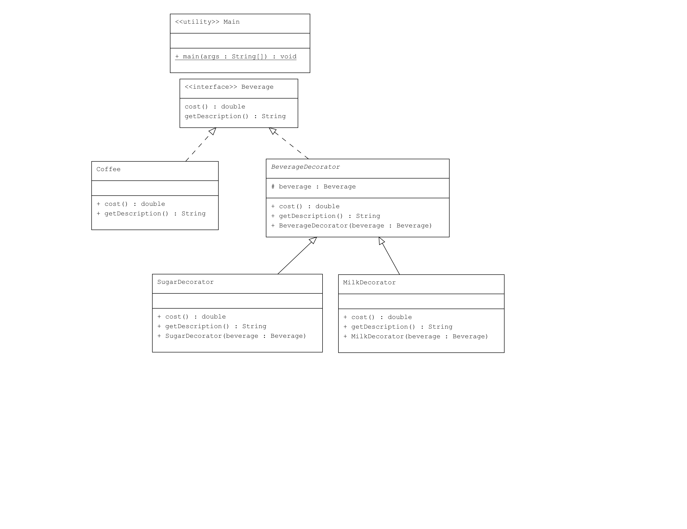

# Decorator Pattern Örneği: İçecek Hazırlama Sistemi

Bu proje, Java'da Decorator Pattern kullanarak içeceklerin özelliklerini dinamik olarak genişletmeyi gösteren bir uygulamayı içermektedir.

## Örnek Senaryo

Bu örnekte:
- **Beverage**: İçecekleri temsil eden bir arayüz.
- **Coffee**: `Beverage` arayüzünü uygulayan ve temel bir içecek türü olan kahveyi temsil eden sınıf.
- **BeverageDecorator**: `Beverage` arayüzünü uygulayan ve içeceklere ek özellikler eklemek için kullanılan soyut sınıf.
- **MilkDecorator ve SugarDecorator**: `BeverageDecorator` sınıfını genişleten ve içeceklere süt ve şeker eklemek için kullanılan sınıflar.

## Uml Diagram


## Kod Yapısı

Tüm sınıflar `src/` dizini altında bulunmaktadır.

### 1. `Beverage` Arayüzü

Dosya: `src/Beverage.java`

`Beverage` arayüzü, içeceğin açıklamasını ve maliyetini döndüren metodları tanımlar.

### 2. `Coffee` Sınıfı

Dosya: `src/Coffee.java`

`Coffee` sınıfı, `Beverage` arayüzünü uygular ve kahve içeceğinin temel maliyetini ve açıklamasını sağlar.

### 3. `Decorator` Soyut Sınıfı

Dosya: `src/BeverageDecorator.java`

`BeverageDecorator` soyut sınıfı, `Beverage` arayüzünü uygulayan ve bir içeceğin özelliklerini dinamik olarak genişletmek için kullanılan bir sınıftır. Bu sınıf, `Beverage` nesnesini korur ve onun metodlarını genişletir.

### 4. `MilkDecorator` ve `SugarDecorator` Sınıfları

Dosyalar: `src/MilkDecorator.java`, `src/SugarDecorator.java`

Bu sınıflar, `BeverageDecorator` sınıfını genişletir ve içeceklere süt ve şeker ekler. Her bir dekoratör sınıfı, içeceğin açıklamasını ve maliyetini buna göre değiştirir.

### 5. Kullanım (Client)

Dosya: `src/Main.java`

`Main` sınıfı, içeceklerin ve onların dekoratörlerinin nasıl kullanılacağını gösteren bir ana sınıftır. Çıktıda içeceğin açıklaması ve maliyeti gösterilir.

### Kod Çıktısı

Program çalıştırıldığında aşağıdaki gibi bir çıktı elde edilir:

```plaintext
Coffee $5.0
Coffee, Milk $6.5
Coffee, Milk, Sugar $7.0
```

Yukarıdaki çıktıda, bir kahvenin fiyatı ve süte ve şekere sahip versiyonlarının fiyatları gösterilmektedir.

## Açıklama

`Decorator Pattern`, nesnenin işlevselliğini dinamik olarak genişletmeye olanak tanır. Bu örnekte, `Beverage` nesneleri dinamik olarak dekore edilerek süte veya şekere sahip versiyonlar oluşturulmuştur.

## Lisans

Bu proje [MIT Lisansı](LICENSE) altında lisanslanmıştır.
