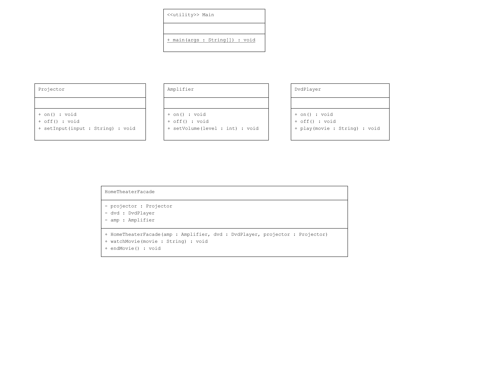

# Facade Pattern : Ev Eğlence Sistemi

Bu proje, Java'da Facade Pattern kullanarak bir ev eğlence sistemini kontrol eden basit bir arayüzü sağlayan bir uygulamayı içermektedir.

## Örnek Senaryo

Bu örnekte:
- **Amplifier**: Amplifikatörü kontrol eden sınıf.
- **DvdPlayer**: DVD oynatıcıyı kontrol eden sınıf.
- **Projector**: Projektörü kontrol eden sınıf.
- **HomeTheaterFacade**: Amplifikatör, DVD oynatıcı ve projektörün kontrolünü sağlayan bir facade sınıfı.
- **Main**: Facade kullanarak ev eğlence sisteminin açılması ve kapatılmasını gösteren ana sınıf.

## Uml Diagram


## Kod Yapısı

Tüm sınıflar `src/` dizini altında bulunmaktadır.

### 1. `Amplifier` Sınıfı

Dosya: `src/Amplifier.java`

Amplifikatörü açma, kapatma ve ses seviyesini ayarlama işlevlerini içerir.

### 2. `DvdPlayer` Sınıfı

Dosya: `src/DvdPlayer.java`

DVD oynatıcıyı açma, kapatma ve film oynatma işlevlerini içerir.

### 3. `Projector` Sınıfı

Dosya: `src/Projector.java`

Projektörü açma, kapatma ve giriş ayarını yapma işlevlerini içerir.

### 4. `HomeTheaterFacade` Sınıfı

Dosya: `src/HomeTheaterFacade.java`

`HomeTheaterFacade` sınıfı, bir ev eğlence sistemini kontrol etmek için kullanılan bir facade sınıfıdır. Bu sınıf:
- `watchMovie(String movie)`: Filmi izlemek için gerekli tüm bileşenleri ayarlar ve çalıştırır.
- `endMovie()`: Filmin sonunda tüm bileşenleri kapatır.

### 5. Kullanım (Client)

Dosya: `src/Main.java`

`Main` sınıfı, `HomeTheaterFacade` sınıfını kullanarak film izleme ve kapatma işlevlerini gerçekleştiren bir ana sınıftır.

### Kod Çıktısı

Program çalıştırıldığında aşağıdaki gibi bir çıktı elde edilir:

```plaintext
Get ready to watch a movie...
Amplifier is on.
Amplifier volume set to 5
DVD Player is on.
Playing movie: Inception
Projector is on.
Projector input set to DVD
Shutting movie theater down...
Projector is off.
DVD Player is off.
Amplifier is off.
```

Yukarıdaki çıktıda, bir film izleme işleminin başlangıcı ve sonu gösterilmektedir.

## Açıklama

`Facade Pattern`, karmaşık bir sistemin basitleştirilmiş bir arayüzünü sunarak kullanıcının sistemi daha kolay kullanmasını sağlar. Bu örnekte, `HomeTheaterFacade` sınıfı, ev eğlence sisteminin çeşitli bileşenlerini kontrol eden tek bir basit arayüz sağlar.

## Lisans

Bu proje [MIT Lisansı](LICENSE) altında lisanslanmıştır.
