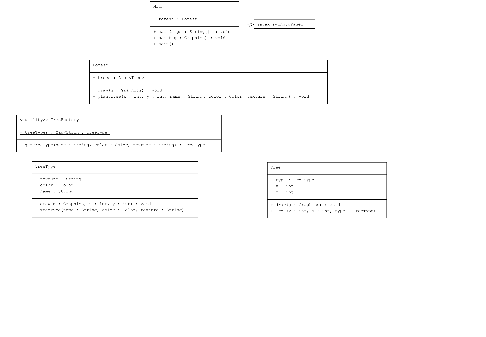

# Flyweight Pattern Örneği: Ağaç Çizimi

Bu proje, Java'da Flyweight Pattern kullanarak bir grafik uygulamasında bellek kullanımını optimize eden bir ağaç çizimi örneği içermektedir.

## Örnek Senaryo

Bu örnekte:
- **TreeType**: Ağaç türlerinin ortak durumlarını (isim, renk, doku) temsil eden flyweight sınıfı.
- **TreeFactory**: Flyweight nesnelerini oluşturan ve yöneten fabrika sınıfı.
- **Tree**: Bağlamsal durum içeren sınıf. Ağaç türünün yanı sıra, her ağacın x ve y koordinatları gibi benzersiz durumlarını da içerir.
- **Forest**: Ağaçları yönetmek ve çizmek için kullanılan sınıf. Ağaçlar flyweight nesneleri aracılığıyla oluşturulur ve yönetilir.
- **Main**: Grafik arayüz kullanarak ağaçları çizmek için kullanılan ana sınıf.

## Uml Diagram

## Kod Yapısı

Tüm sınıflar `src/` dizini altında bulunmaktadır.

### 1. `TreeType` Sınıfı

Dosya: `src/TreeType.java`

Ağaç türlerinin ortak durumlarını temsil eden ve çizim işlemini gerçekleştiren flyweight sınıfıdır.

### 2. `TreeFactory` Sınıfı

Dosya: `src/TreeFactory.java`

Flyweight nesnelerini oluşturan ve yöneten fabrika sınıfıdır. Yeni bir ağaç türü gerektiğinde, önce mevcut türler kontrol edilir ve varsa tekrar oluşturulmaz.

### 3. `Tree` Sınıfı

Dosya: `src/Tree.java`

Bağlamsal durum içeren sınıftır. Ağaç türünün yanı sıra her ağacın benzersiz x ve y koordinatlarını içerir.

### 4. `Forest` Sınıfı

Dosya: `src/Forest.java`

Bir ormandaki ağaçları yönetmek ve çizmek için kullanılan sınıftır. Ağaçlar flyweight nesneleri aracılığıyla oluşturulur ve yönetilir.

### 5. Kullanım (Client)

Dosya: `src/Main.java`

`Main` sınıfı, `Forest` sınıfını kullanarak ağaçları çizen grafik arayüzü içeren ana sınıftır.

## Açıklama

`Flyweight Pattern`, bellek kullanımını optimize etmek için büyük miktarda benzer nesneye sahip olunan durumlarda kullanılır. Bu desen, benzer nesneler arasındaki ortak durumları paylaşarak bellek tasarrufu sağlar. Bu örnekte, farklı türdeki ağaçlar `TreeType` sınıfı aracılığıyla yönetilir ve ortak durumlar paylaşılır.

## Lisans

Bu proje [MIT Lisansı](LICENSE) altında lisanslanmıştır.
