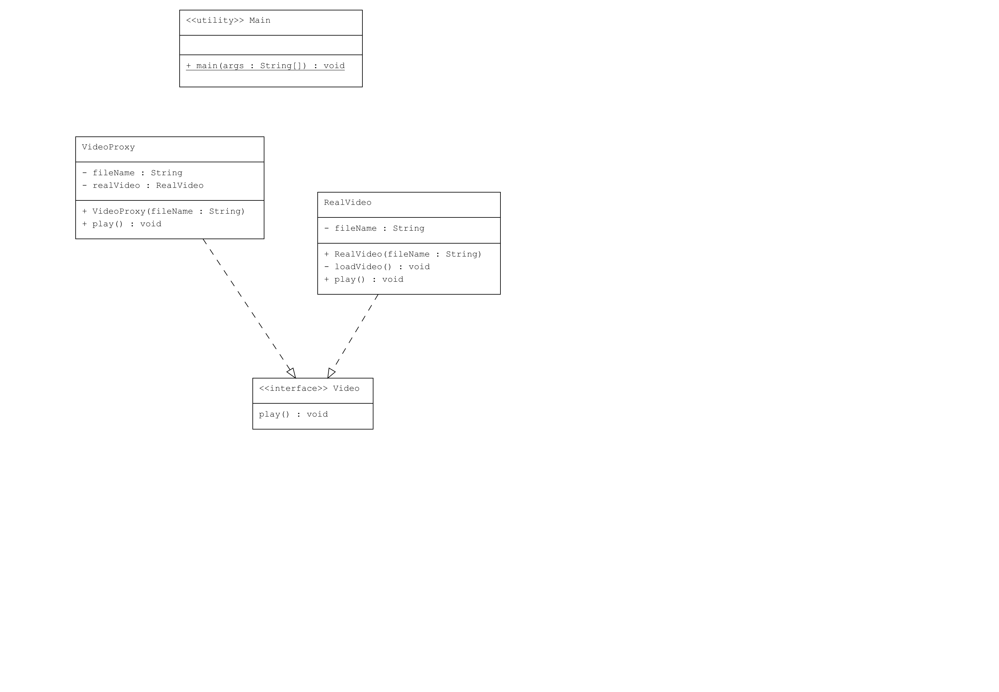

# Proxy Pattern : Video Oynatıcı

Bu proje, Java'da Proxy Pattern kullanarak bir video oynatıcı uygulaması geliştirmektedir. Proxy Pattern, bir nesneye erişimi kontrol etmek veya bir nesneye erişim sağlamak için kullanılır.

## Örnek Senaryo

Bu örnekte:

- **Video Arayüzü (`Video.java`)**: `play()` metodunu tanımlar.
- **Gerçek Video Sınıfı (`RealVideo.java`)**: `Video` arayüzünü uygular ve gerçek video oynatma işlemlerini yapar.
- **Proxy Sınıfı (`VideoProxy.java`)**: `Video` arayüzünü uygular ve `RealVideo` sınıfına kontrollü erişim sağlar.
- **Kullanım (Client - `Main.java`)**: Proxy nesnesini kullanarak videoları oynatır.

## Uml Diagram

## Kod Yapısı

Tüm sınıflar `src/` dizini altında bulunmaktadır.

### 1. `Video` Arayüzü

Dosya: `src/Video.java`

Konu arayüzüdür ve `play()` metodunu tanımlar.

### 2. `RealVideo` Sınıfı

Dosya: `src/RealVideo.java`

`Video` arayüzünü uygulayan gerçek sınıftır. Video yükleme ve oynatma işlemlerini gerçekleştirir.

### 3. `VideoProxy` Sınıfı

Dosya: `src/VideoProxy.java`

`Video` arayüzünü uygulayan proxy sınıfıdır. `RealVideo` sınıfına kontrollü erişim sağlar. İlk `play()` çağrısında video yüklenir ve oynatılır. Daha sonraki çağrılarda ise yalnızca video oynatılır.

### 4. Kullanım (Client)

Dosya: `src/Main.java`

`Main` sınıfı, `VideoProxy` sınıfını kullanarak video oynatma işlemlerini gerçekleştirir.

## Açıklama

`Proxy Pattern`, bir nesneye erişimi kontrol etmek veya onu kontrol altında tutmak için kullanılan bir yapısal tasarım desenidir. Bu desen, istemcinin doğrudan nesneye erişmesini önler ve erişimi kontrol altında tutar.

Bu örnekte, video yükleme işlemi ağır bir işlemdir ve gereksiz yere tekrarlanmasını önlemek için proxy kullanılmıştır. `VideoProxy` sınıfı, yalnızca ilk erişimde `RealVideo` sınıfını yükler ve sonraki erişimlerde doğrudan oynatma işlemini gerçekleştirir.

## Lisans

Bu proje [MIT Lisansı](LICENSE) altında lisanslanmıştır.
