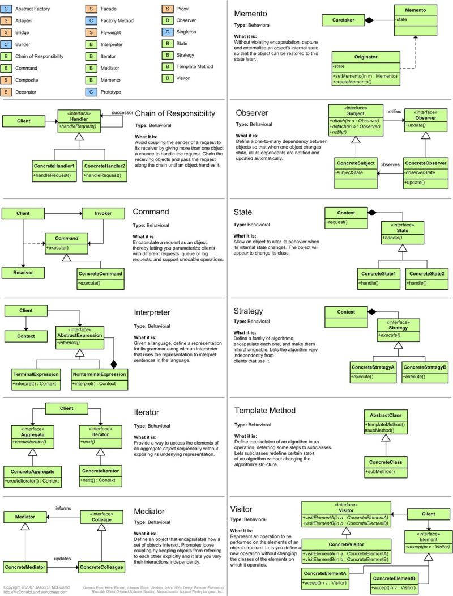
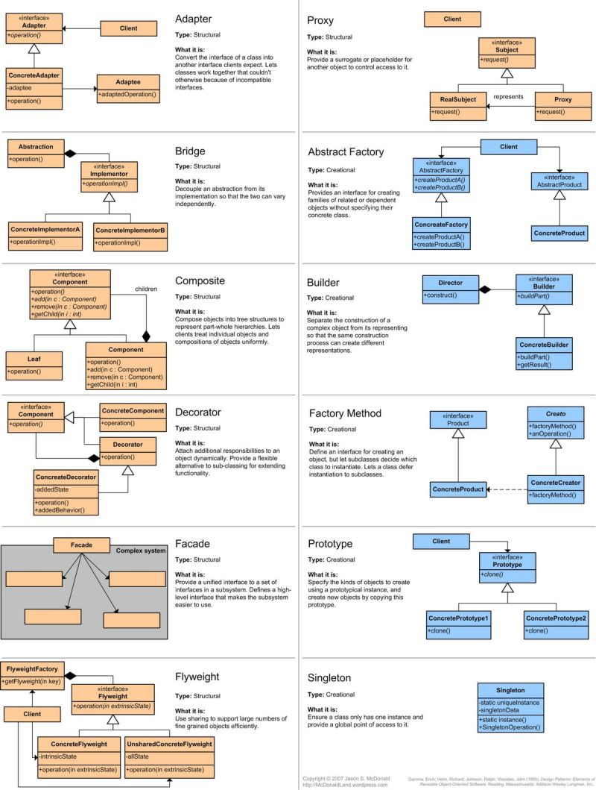

# Design Patterns 

Bu proje, Java'da çeşitli tasarım desenlerini (design patterns) örnekleyen kodları içermektedir. Tasarım desenleri, yazılım geliştirme sürecinde karşılaşılan belirli sorunlara yönelik tekrar kullanılabilir çözümler sunar. Bu repo, üç ana kategori altında birçok tasarım desenini örnekler:

- **Creational Patterns**: Nesne oluşturma süreçlerini yönetir.
- **Structural Patterns**: Nesneler ve sınıflar arasındaki yapıları düzenler.
- **Behavioral Patterns**: Nesneler ve sınıflar arasındaki etkileşimleri yönetir.

### Cheat Sheet

## İçerik

### 1. Creational Patterns

Creational Patterns, nesne oluşturma süreçlerini yöneten desenlerdir. Bu desenler, nesnelerin nasıl yaratıldığını belirler ve bu süreçleri daha esnek ve yönetilebilir hale getirir.

- **Singleton Pattern**: Tek bir nesne örneğinin varlığını garanti eder ve bu örneğe global bir erişim sağlar.
- **Factory Method Pattern**: Alt sınıfların hangi sınıfın örneğini oluşturacağına karar verir.
- **Abstract Factory Pattern**: Birbiriyle ilişkili veya bağımlı nesne ailesi oluşturmaya yönelik bir arayüz sağlar.
- **Builder Pattern**: Karmaşık nesnelerin adım adım oluşturulmasını sağlar.
- **Prototype Pattern**: Var olan bir nesnenin kopyasını yaratır ve bu kopyalar üzerinde değişiklikler yapar.

### 2. Structural Patterns

Structural Patterns, sınıflar ve nesneler arasındaki yapıları düzenler. Bu desenler, nesneler arasındaki ilişkileri tanımlar ve bu ilişkileri yönetir.

- **Adapter Pattern**: Farklı arayüzleri olan sınıfları bir araya getirir.
- **Bridge Pattern**: Abstraction ve Implementation arasındaki ilişkiyi ayırır ve her birini bağımsız olarak değiştirir.
- **Composite Pattern**: Nesne ağaç yapılarının oluşturulmasını sağlar.
- **Decorator Pattern**: Nesnelere dinamik olarak yeni işlevler ekler.
- **Facade Pattern**: Karmaşık bir sistemi daha basit bir arayüzle sunar.
- **Flyweight Pattern**: Nesne yaratımını minimize eder ve belleği daha verimli kullanır.
- **Proxy Pattern**: Bir nesnenin yerini alır ve ona erişimi kontrol eder.

### 3. Behavioral Patterns

Behavioral Patterns, nesneler ve sınıflar arasındaki etkileşimleri yönetir. Bu desenler, nesneler arasındaki iletişimi düzenler ve bu iletişimlerin nasıl gerçekleşeceğini belirler.

- **Chain of Responsibility Pattern**: Bir isteği işleyebilecek nesneler zincirini oluşturur.
- **Command Pattern**: İşlemleri nesneler olarak kapsüller ve bu işlemleri bağımsız olarak yürütür.
- **Interpreter Pattern**: Bir dilin gramerini tanımlar ve bu dildeki ifadeleri yorumlar.
- **Iterator Pattern**: Koleksiyon elemanlarına sırayla erişim sağlar.
- **Mediator Pattern**: Nesneler arasındaki iletişimi merkezi bir aracı üzerinden yönetir.
- **Memento Pattern**: Nesnelerin iç durumlarını korur ve geri yüklemeyi sağlar.
- **Observer Pattern**: Bir nesnedeki değişiklikleri gözlemleyen diğer nesnelere haber verir.
- **State Pattern**: Nesnenin durumuna göre davranışını değiştirir.
- **Strategy Pattern**: Bir algoritmayı tanımlar ve bu algoritmanın nasıl kullanılacağını belirler.
- **Template Method Pattern**: Bir algoritmanın iskeletini tanımlar ve bazı adımların alt sınıflar tarafından gerçekleştirilmesini sağlar.
- **Visitor Pattern**: Nesneleri ziyaret eden ve onlarla işlem yapan ziyaretçiler tanımlar.

## Kullanım

Her tasarım deseni için ilgili kod örnekleri ve kullanım senaryoları `src/` dizini altında bulunabilir. Her örnek, desenin nasıl uygulandığını ve ne işe yaradığını gösteren bir senaryo içerir.

## Lisans

Bu proje [MIT Lisansı](LICENSE) altında lisanslanmıştır.

`by Ömer ÖZCAN`
